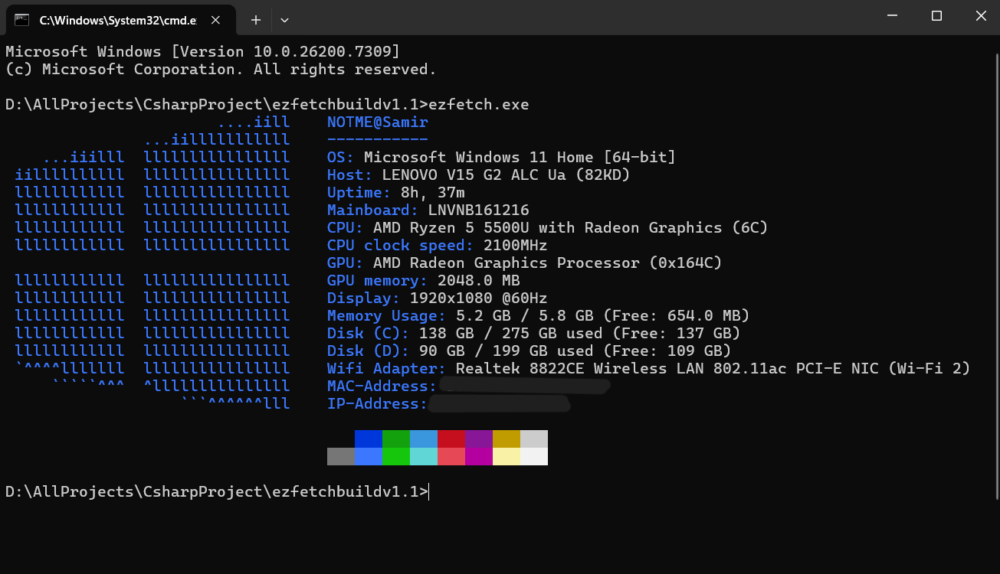

# Ezfetch
Ezfetch is a simple command-line system information utility tool for fetching and displaying system information, in a visually appealing way.
It is written mainly in C#, with a focus on simplicity and ease of use. Currently this tool only works on Windows devices.

---
## Screenshot

---
## Installation
- To install _**Ezfetch**_, you can download the latest release from the [Releases](https://github.com/SamirKumar314/ezfetch/releases)
- Navigate to the folder where the file is downloaded.
- Type `cmd` in the address bar and hit enter to open Command Prompt in that folder.
- Type `ezfetch.exe` and hit enter to run the program.

Alternatively, you can add the folder containing `ezfetch.exe` to your system's PATH environment variable for easier access from any command prompt.
- Search for "**Environment Variable**" in Windows search bar.
- Click on Environment Variables on the Advanced tab.
- Now under User variables, select the Path variable and click Edit.
- Click New and add the path to the folder where `ezfetch.exe` is located. (e.g. `C:\Users\Username\Downloads\FolderName`)
- Click OK to save the changes.
- Now you can open Command Prompt from any location and just type `ezfetch` to run the program.